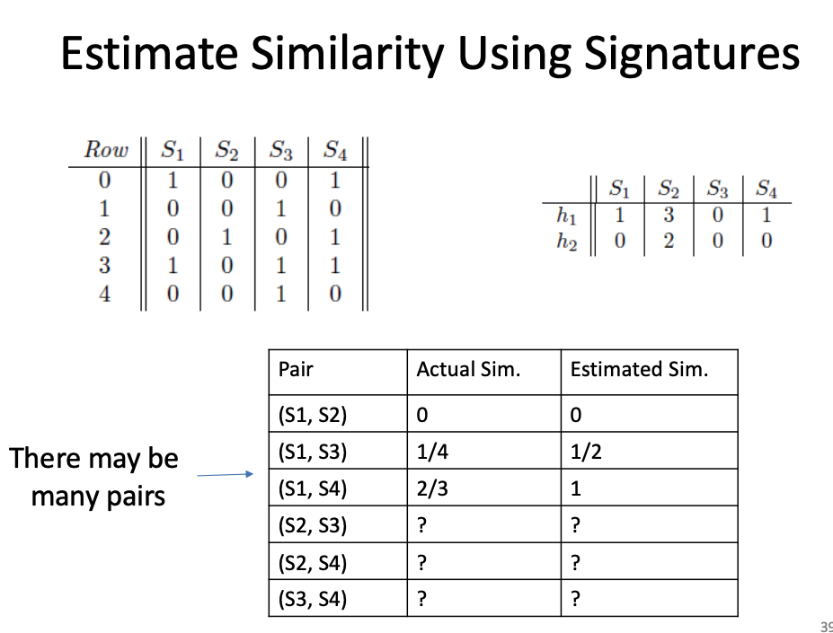
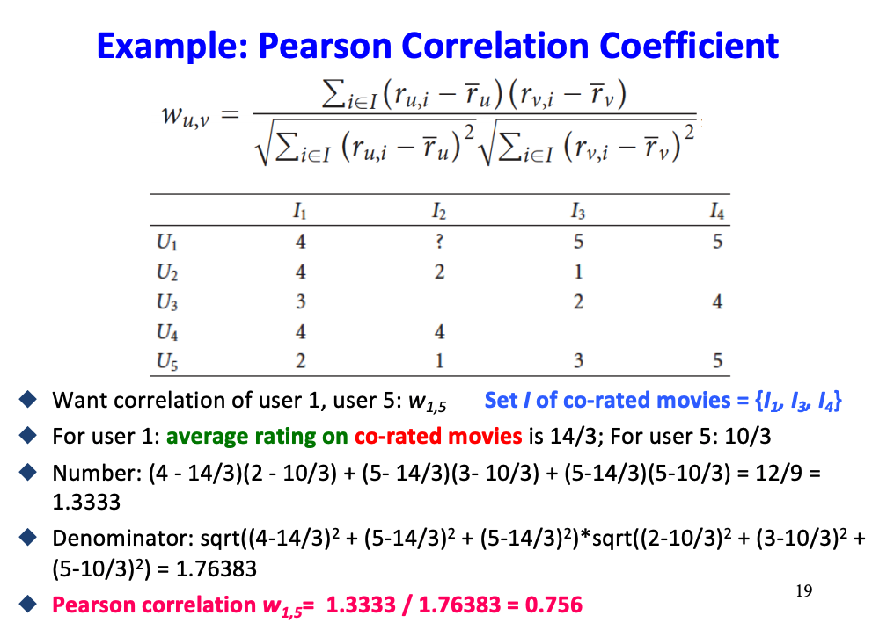
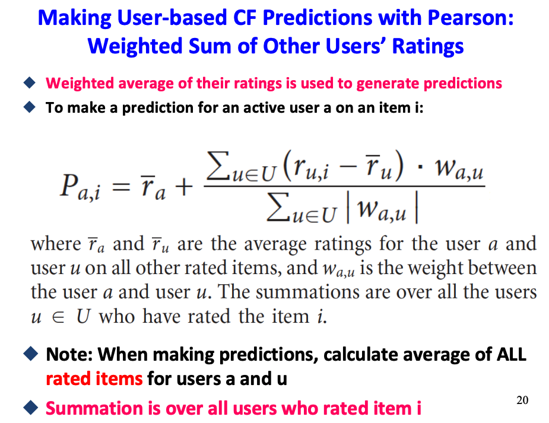
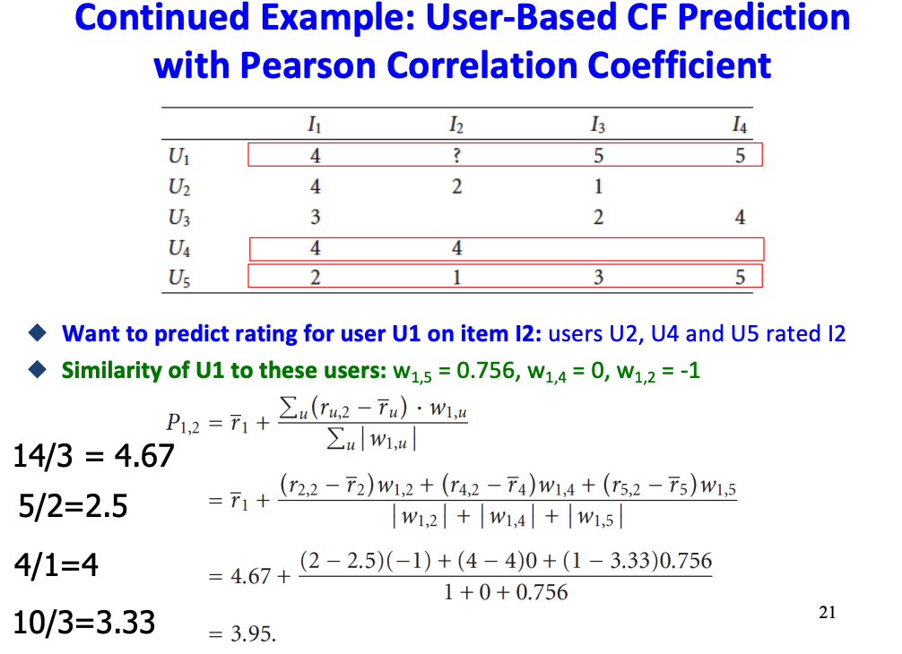
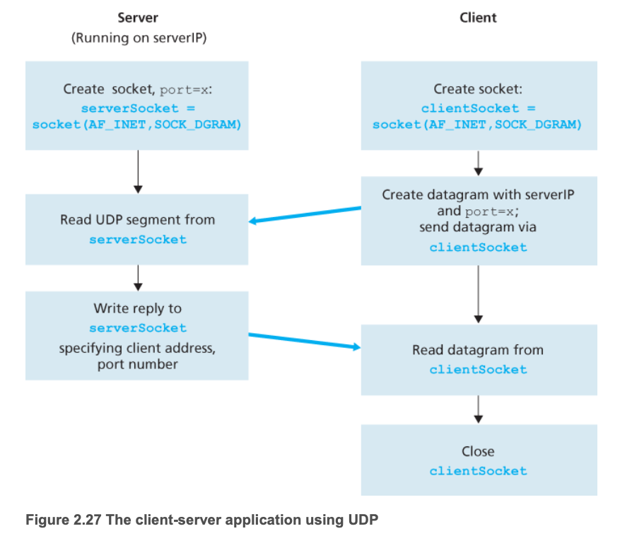
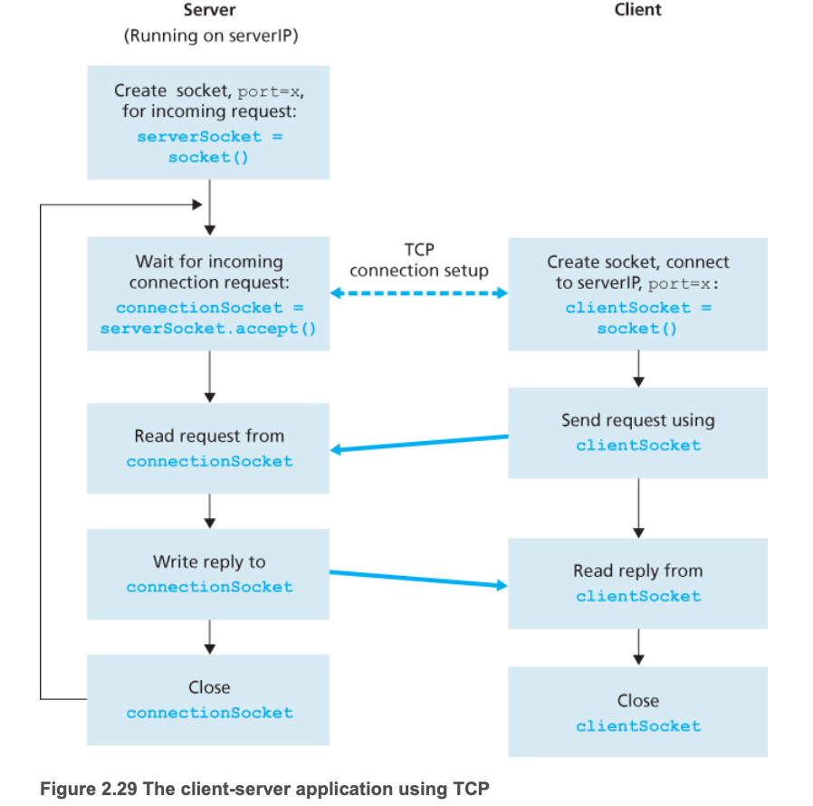
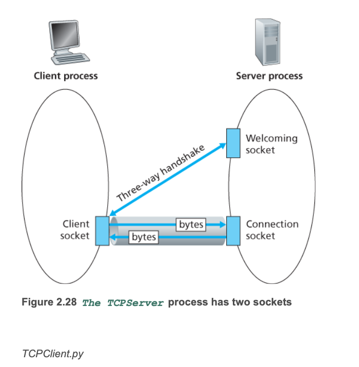

- [SwiftUI iOS 纸牌游戏](#SwiftUIiOS纸牌游戏)
- [天气预报iOSApp](#天气预报iOSApp)
- [数据挖掘Yelp大规模数据集](#数据挖掘Yelp大规模数据集)
- [Unix操作系统内核](#Unix操作系统内核)
- [天气预报网站](#天气预报网站)
- [CrownClothing网站](#CrownClothing网站)
- [YelpCamp网站](#YelpCamp网站)
- [Socket_Programming](#Socket_Programming)
- [面经1](#面经1)
- [面经2](#面经2)
- [面经3](#面经3)
```
我是一名南加州大学在读计算机科学研究生，预计2020年底毕业，平时热衷于技术的学习
目前最倾向iOS开发，原因是之前上过Stanford的一个ios公开课，很崇拜这门课的教授，他的代码十分的简洁优雅。我很喜欢
```

## SwiftUIiOS纸牌游戏
- [天气预报iOSApp](#天气预报iOSApp)
```
SwiftUI iOS 纸牌游戏 (https://github.com/weilingao/Memorize_CardGame_CS193p) 2020 年 11 月 – 至今
• 基于 SwiftUI 开发一个翻转纸牌并匹配具有相同 emoji 的纸牌的 iOS 游戏
• 设计架构是 MVVM，并结合了 Reactive UI 使 View 始终与 Model 保持同步使得纸牌翻转
• 利用 GeometryReader 自动分配纸牌大小，比例和位置，利用 ViewModifier 和 ViewBuilder 重构 View，添加了一些 animation
```

1. 使用SwiftUI的声明性方法(declarative approach)来构成用户界面。
2. - 建立了MVVM基础框架
   - View提供declarative的views
   - ViewModel提供访问Model的数据，以及Intent functions使得View可以调用Model的函数。View可以共享ViewModel的intent函数，ViewModel的类型为class便于共享, ViewModel建立了Model的实例，因为Model是generic type。
   - Model提供游戏的数据和逻辑，包括了卡牌是否match，是否翻转，选择卡牌的操作
3. - ViewModel里的model变量包装成@Published，一旦观察到Model有变化，就publish有变化了，调用objectWillChange.send(), View里的ViewModel变量有ObservedObject，一旦viewModel publish了，就重新画view
   - 根据上面的理论实现了reactive programming, 一旦点击卡牌，卡牌会有翻转效果
   - 通过ViewModel更新模型以及使UI始终与模型保持同步来使卡翻转。

## 天气预报iOSApp
- [数据挖掘Yelp大规模数据集](#数据挖掘Yelp大规模数据集)
```
天气预报 iOS App (https://www.bilibili.com/video/BV1kr4y1F79r) 2019 年 09 月 – 2019 年 12 月
iOS App, Swift, Xcode, Cocoapods, Node.js, Express.js
• 开发基于 MVC 设计架构的天气预报 iOS App，使用户可以搜索当地和特定城市的天气信息
• 设计自定义滑动视图(XIB)，并动态生成水平滑动页面以显示天气信息
• 用户可以将自己喜欢的城市添加到本地存储中(UserDefaults)，方便之后再检索这些城市的天气信息
• 利用 Cocoapods 管理第三方依赖并实现加载 loading spinner 和 toast message
```

## 数据挖掘Yelp大规模数据集
- [Unix操作系统内核](#Unix操作系统内核)
```
数据挖掘 Yelp 大规模数据集 2020 年 05 月 – 2020 年 07 月 Apache Spark, PySpark, MapReduce, Recommendation System, Collaborative Filtering, Python, Scala, Apache RDD
• 使用 Spark 以 MapReduce 方式实现 SON 算法，并使用 PCY 算法处理每个 Yelp 数据块(Market-Basket 模型);查找所有商家的频繁 项集(frequent itemsets) 并生成关联规则(associative rules)，然后根据其关联规则推荐适合的商家
• 根据 Jaccard 相似度(Jaccard similarity)实现 Min-Hash 和 Locality Sensitive Hashing 算法以查找相似的商家对(business pairs)
• 通过使用 TF-IDF 算法，根据评论文本为用户和商家创建 profiles 来建立基于内容的推荐系统(content-based recommendation
system)，然后计算 user profile vectors 和 item profile vectors 的余弦相似度(cosine similarity)来预测用户是否喜爱某特定的商家
• 通过计算 Pearson correlation 并结合 Min-Hash 和 LSH 算法，构建基于项目/用户的协作过滤推荐系统(item-based/user-based
collaborative filtering recommendation systems)，然后使用模型预测某特定用户对某特定商家的评分
```
1. - 第一个内容是根据一个大规模的yelp数据集，用户和商家映射对，来为之前评论过一些商家的用户来推荐一些他可能感兴趣的其他商家，具体实现是用apache spark在分布式的环境下，实现son算法，来更高效地找到所有可能的频繁项集的组合。这里的频繁项集就是指我们将要计算出现的次数频率高的商家组合，其中包括了单个商家的组合，两个商家的组合，甚至三个商家的组合，这些商家组合的出现频率会超过预设定的某一阀值。在这里我们需要建立market-basket模型，这里的话就是为某一个用户建立一个篮子，篮子里包含了每个被某一用户评论过的商家。然后再通过频繁项集来生成关联规则来为用户推荐适合的商家
   - son算法的具体实现：我们把每个商家组合都看成是一个篮子，整个数据集就是通过一个个篮子组成的，然后将整个数据集分割成一个个数据子集，每个子集有一些篮子，然后我们将这些子集分布式地/map-reduce地读入到内存中，跑一个基于内存的算法。son算法分为两个阶段：
        1. 第一个阶段，在map的过程中，如果在一个子集里一个篮子被发现是出现频率高的，那么这个篮子将成为一个候选者，输出一系列的(frequent_itemset, 1)键值对/key-value pair，这里计算频率高的篮子会用一个算法叫pcy，
            1. pcy算法是哈希过滤的一种应用，具体实现也是分为两个阶段: 第一阶段，先是计算每个单独商家在子集中出现的次数，得到出现次数频繁的单个商家们，然后维护一个哈希表，将每个可能的商家项集哈希作为键，对每个桶进行计数，然后根据阀值标记这个桶是否频繁。第二阶段，一个商家项集只当满足了项集里每个商家都是频繁的且哈希映射的值是频繁的，那么就可以输出为候选人项集。这样做的原因是可以减去大量频率低的项集的运算，提高运算速度，也减小了对内存的需求

            然后在reduce的过程中，每个reduce任务就是输出在每个子集里频繁项集来作为候选人项集。

        2. 第二个阶段，在map的过程中，每个map任务都有一个input chunk子集，然后计算每个候选人项集在input chunk的出现次数，在reduce过程中，计算每个候选项集在整个数据集的频率
2. - 第二个内容是预估相似的商家对，其中他们的Jaccard 相似度 >= 0.05。给到一个矩阵，横轴为各个商家，纵轴为每个用户给商家的点赞或点踩的情况。如果用户对商家进行了点赞，则用户在特征矩阵中的贡献为1。如果用户对商家进行了点踩，则贡献为0。这里用到的算法是Min-Hash和LSH，先是min-hash，定义特征矩阵的行条目排列的哈希函数集合。就是说让每个商家都保持一个数据列，数据列里每一行都代表着每个不同的哈希函数，这个哈希函数可以使得一个商家的用户1/0的数据列进行顺序排列，这其中的数据就是在这个特定的排列顺序下这个商家收到的一个点赞的位置/索引，这样就可以构建出了一个签名矩阵，根据这个签名矩阵再用Jaccard相似度来预估两个商家对之间的相似度。然后是实现lsh算法，将矩阵划分为若干个波段，每个波段带若干个行，如果两个商家的签名在至少一个波段中相同，则它们将成为候选商家对。然后最后评估准确性的依据就是根据原始数据来计算每两个商家对之间的Jaccard相似度，然后来看我们的预估准不准。这两个算法的意义主要就是减少了数据的计算量，加快计算速度

    

3. - 第三个内容是基于内容的推荐系统，目的是预测用户是否喜爱某特定的商家。推荐给用户与过去喜欢的商家具有相似内容的商家。具体实现是先是根据评论文本为用户和商家生成profile/资料向量，就是一个向量，然后使用模型来预测用户是否喜欢给定的商家，方式是计算用户和商家资料向量之间的余弦相似度。具体的模型实现是先连接一个商家收到的所有评论文本，删除极其罕见的词，使用TF-IDF测量词的重要性，对于每个商家，请使用TF-IDF得分最高的前200个单词来描述文档，创建商家资料/profile，向量可以是具有所有有效词的布尔向量。通过汇总每个用户已评论的商家的资料向量/profile vector来创建相应用户的资料向量/profile vector。在预测过程中，您将通过计算配置文件矢量/profile vectors之间的余弦距离来估计用户是否希望查看某个商家。 如果（用户，业务）对的余弦相似度> = 0.01，则将它们视为有效对。得到的预测是{用户/商家/相似度}的集合。

4. - 第四个内容是协同过滤推荐系统，目的是预测某特定用户对某特定商家的评分，推荐系统通过收集用户反馈来工作：例如，对商家的评分，利用用户在评级行为上的相似性来确定推荐。根据用户过去的行为（先前购买或评价过的商品）以及其他用户做出的类似决定来构建模型，使用模型预测用户可能喜欢的商家。这是一个基于用户的CF推荐系统。
    -  先是训练数据的过程，如果潜在用户对的数量太大而无法在内存中进行计算，则可以在基于用户的CF推荐系统中结合使用Min-Hash和LSH算法。识别使用共同评分商家相似的用户对，此过程减少了我需要比较最终Pearson相关评分的用户对的数量，而不考虑其评分分数，然后计算具有Jaccard相似度> = 0.01且至少有3个共同评级商家的用户对候选者的Pearson相关性。这里的Pearson相关性是指Pearson相关系数，用来度量两个变量线性相关的程度。得到了模型{user, business, pearson相关性}
    

    - 在预测过程中，我使用该模型预测给定的用户和商家对的评级，我使用与目标用户最相似的N个用户邻居进行预测，然后根据其他用户评分的加权平均值用于生成预测
    
    

## Unix操作系统内核
- [天气预报网站](#天气预报网站)
```
• 在 Ubuntu 16.04 虚拟机上完成来自 Brown University 的类 Unix 操作系统内核 WEENIX
• 创建在内核模式下并发运行的线程和进程的生命周期，包括互斥锁，调度程序等
• 创建虚拟文件系统，在 OS 内核和基础文件系统(S5FS)之间编写 UNIX 的系统调用接口
• 创建一个虚拟内存，使内核可以管理用户地址空间(user address spaces)，实现虚拟内存映射(virtual memory maps)，实现系统调用
fork()，实现页错误处理(page fault handler)，使用 shadow memory objects 来实现写时复制(copy-on-write)
```
- kernel1
    1. 提供Weenix操作系统的基本构建块：线程，进程和同步原语。
    
        已经编写了许多用于执行基本内核操作（如内存分配和页表管理）的代码。内核将能够在内核模式下同时运行多个线程和进程。您将使用slab allocators完成大多数内核内存管理。bootstrap（）的目标是建立第一个内核线程和进程（它们一起称为init进程），并执行其主例程。init进程将执行进一步的初始化并启动初始化过程。
    2. 线程和进程：
    
        Weenix能够运行多个进程和线程。Weenix中没有内核模式抢占（所有线程都运行，直到它们明确产生对处理器的控制权为止）。可以将进程视为一些线程和一些元数据的集合。 杀死进程等同于杀死其线程，反之亦然。
    
        线程和进程的生命周期相对简单。 创建进程时，应向其中添加线程，并应通过将其线程添加到运行队列来使该进程可运行。 如果某个进程退出并且仍然有子进程，则应将这些子进程重新分配给init进程，在执行某些系统设置后，该进程将处于收集孤立进程的循环中。 当线程尝试退出当前进程时，该进程代码必须取消同一进程中的任何其他线程（如果有多个线程，则与它们join），以便它们可以执行其当前任务所需的任何清理。 每个线程完成清理其当前任务后，将调用流程代码以指示其正在退出，以便该流程可以对线程数据结构进行任何最终清理。

        一旦所有线程退出，进程便可以退出，其祖先之一（其父进程或init进程）将调用do waitpid（）并将其完全清除。使用这种有点奇怪的释放系统的原因是，只能从另一个线程的上下文中清除进程和线程数据结构的某些元素。
    3. 调度器Scheduler: 
    
        一旦创建了进程和线程，您将需要一种方法来运行这些线程并在它们之间切换。 Weenix的调度程序仅由先进先出队列组成。特别是，只有一个运行队列，线程从队列中出队（仅当正在运行的线程显式地产生控制权时），然后切换到处理器上。 系统中还有许多等待队列，其中大多数将用作某些互斥锁的一部分。 当线程到达其等待队列的前端时，可以将其唤醒，这包括将其放在运行队列中，等待其到达运行队列的开头，然后被其他运行切换例程的线程切换到处理器上。
        
        线程之间的切换是在该区域编写的最棘手的代码，应谨慎执行，以免与硬件中断发生不良交互。为了编写正确的切换功能，您必须从运行队列中删除第一个线程，将当前线程和当前进程的全局变量设置为指向新线程及其进程，然后切换到新上下文，所有这些中断都被阻止（使用中断优先级或IPL）。如果没有屏蔽，则在任何两个代码指令之间都会发生硬件中断。
    4. 同步原语Synchronization Primitives：
        
        由于内核是多线程的，因此我们需要某种方法来确保多个线程不会同时执行某些关键路径。 调度功能工作后，您也应该能够实现同步原语。 Weenix中使用的唯一同步原语是互斥体mutex，其实现使用单个FIFO线程队列，也可以实现条件变量，信号量，屏障等。

- kernel2
    1. 虚拟文件系统（称为“ VFS”）在操作系统内核与各种文件系统之间提供了公共接口。 VFS接口允许一个人将许多不同类型的文件系统添加到一个人的内核中，并通过相同的UNIX风格的接口访问它们。多态是VFS的重要设计属性。 对VFS的常规调用（例如read（）和write（））是在每个文件系统的基础上实现的。

    2. 构造函数：
    
        文件系统由特殊类型（fs t结构）表示，需要根据其特定的文件系统类型进行初始化。因此，对于每个文件系统，都有一个例程初始化该结构的文件系统特定字段。我们在Weenix中为这些“构造函数”使用的约定是拥有一个名为<fsname> mount（）的函数，该函数接收一个fs t对象。

    3. 虚函数：
    
        虚函数（在某些“超类”中定义但可能被某些子类特定的定义“覆盖”的函数）在Weenix VFS中通过函数指针的结构实现。 每种文件系统类型都有其自己的功能，可实现每个文件系统操作。 这些函数的命名约定是在函数的通用名称前加上文件系统类型，因此，例如，用于s5fs文件系统的read（）函数将被称为s5fs read（）。 每种文件系统类型都有一个类型为fs ops t的结构，该结构列出了可以在该文件系统上执行的所有操作。 在文件系统的构造函数中，将指向这些fs ops t的指针添加到正在初始化的fs t结构中。 然后可以通过指针调用这些函数，您便具有即时多态性。
    
    4. 每个进程都有一个与之关联的文件描述符表，每个进程的数组由该进程打开的文件描述符索引。如果未使用文件描述符，则该条目的指针为NULL。否则，它必须指向有效文件t。每个文件t都包含一个指向活动vnode t的指针。通过vnode t函数指针，您可以与基础文件系统进行通信，以管理vnode表示的文件。所有这些指针都摆在身边，很难分辨何时可以清理分配的vnode ts和file ts。这是引用计数的来源。
    
    5. 引用计数/Reference Counting：

        正如VFS概述中所讨论的，有许多指向vnode ts和file ts的指针，但是我们需要确保一旦所有指向结构的指针都消失了，该结构就被清理了，否则我们将泄漏资源！下面描述的* get（）函数不是直接为这些结构分配空间，而是在系统表中查找结构，并在尚不存在适当的条目的情况下创建新条目。同样，Weenix并没有直接清除这些结构，而是使用* put（）函数来减少引用计数并在必要时执行清除。 Weenix中的其他系统将这些函数与* ref（）函数一起使用以正确管理引用计数。

    6. 常驻页面引用/Resident Page References

        由于初始化磁盘上的数据可能是昂贵的初始化操作，因此磁盘驱动程序会以大块（通常为块大小）来完成它们。文件系统通过在内存中缓存数据块来利用此优势，以便将来的读取可以访问数据而无需返回磁盘，并且可以在缓存中执行将来的写入。在Weenix中，此缓存由mmobj ts完成。每当块被缓存时，它都有一个指向“拥有”其数据的vnode的指针（因此会增加vnode的引用计数）
    
    7. 编写UNIX系统调用界面的大部分来操纵文件（文件t和vnode t）的内核数据结构。我们将为您提供一个简单的in-memory文件系统以进行测试（ramfs）。
    
    8. Pathname to vnode Conversion：共同实现我们从名称到vnode的所有转换需求。
    9. system calls: read a file/ do_write /  dup a file / do_close

- kernel3
    1. 通过添加虚拟内存，您的内核将开始管理用户地址空间，运行用户级别的代码以及为系统调用提供服务。
    2. 虚拟内存映射:

        做的第一件事是编写用于管理进程的虚拟地址空间的代码。进程的虚拟地址空间（也称为其“内存映射”）存储为虚拟内存区域（也称为“内存区域”）的链接列表

        为了管理地址空间，您必须维护每个进程的虚拟内存区域列表。每个存储区域本质上是虚拟页码，存储对象和虚拟存储区的第一页所对应的该存储对象中的页偏移量的范围。
    3. 页面错误处理程序
        
        内存映射工作后，您将需要一种在进程尝试访问数据时将数据实际加载到内存中的方法。这是由页面错误处理程序完成的。当进程尝试访问其在页表中没有查找条目的地址或该条目上的权限不允许尝试的访问类型时，处理器中断将触发页面错误处理程序。

    4. 内存管理单元
        
        为了将虚拟地址映射到其对应的内存页，您将需要使用页表功能。 大部分的内存管理工作都已为您完成，但是当发生页面错误时，您将必须填写页面表条目，在必要时刷新转换后备缓冲区（TLB），并自行管理写时复制页面。
    
    5. 匿名对象

        您通常想要的对象是通过用零填充页面来初始化页面并将它们的页面固定在内存中的，只要进程正在使用它们即可。这些被称为匿名对象，因为它们没有任何持久性数据（该数据具有与之关联的文件名）的支持。

    6. 阴影对象
        
        匿名对象易于实现，但是您还需要一种更复杂的内存对象形式（称为影子对象）来实现fork（）。这些将用于为分叉后访问的私有映射块实现写时复制。由于必须涉及阴影对象，

    7. 系统调用
        
        系统调用是用户进程可以直接与Weenix内核进行通信的唯一方法。从用户空间生成系统调用的方式是通过生成软件中断（使用x86 int指令），并将软件调用的参数存储在寄存器或堆栈中。这会在内核中引起中断，其中同意的寄存器中的数字指定正在使用哪个系统调用，然后在从其寄存器中解析出参数之后，实际上会调用相应的系统调用函数来处理请求。为read（），write（）和getdents（）实现内核目标

    8. 与VM相关的系统调用

        mmap（）和munmap（）是此类中最简单，最明显的函数。它们允许用户进程将文件映射到内存，创建私有或共享内存区域以及删除其地址空间区域。由于您在虚拟内存映射代码中为这些函数编写了主要逻辑，因此其中大多数功能最终都将进行错误检查。

        fork（）
    9. 实现步骤：

        •使用proc create（）创建一个新进程。
        •使用vmmap clone（）将vmmap t从父进程复制到子进程（如果尚未写入，则应编写）。切记要增加对基础内存对象的引用计数。
        •对于原始进程中的每个私有映射，将新进程和旧进程的虚拟内存区域指向两个新的影子对象，而影子对象又应指向原始的基础内存对象。这是您知道与该映射相对应的页面是写时复制的方式。
        .在写入时复制，我们希望访问这些页面以导致陷阱，我们的页面错误处理程序，以便它可以弄脏页面，这将调用写时复制操作。
## 天气预报网站
- [CrownClothing网站](#CrownClothing网站)
```
天气预报网站 (http://weilingao-csci571-hw8-adeuba5aaa.us-east-2.elasticbeanstalk.com/) 2019 年 09 月 – 2019 年 12 月 Angular 8, Node.js, AJAX, JSON, HTML5, Bootstrap 4
• 使用 Angular 8 作为前端框架(component/service 模型)，使用 Node.js 和 Express.js 作为后端开发了网页版的天气预报
• 构建 service 以在所有 components 之间共享数据并使用 AJAX 处理与后端 API 的异步数据交换
• 支持输入自动补全机制(Angular Material)，收藏夹系统(HTML5 本地存储)，利用条形图显示未来几天的天气情况
```
## CrownClothing网站
- [YelpCamp网站](#YelpCamp网站)
```
Crown Clothing 网站 (https://crwn-clothing-weilingao.herokuapp.com/) 2019 年 07 月 – 2019 年 08 月
React, React-Router, SASS, Firebase, JavaScript
• 利用 React 框架设计购物网站，使用 React-Router 实现用户可以在不同类别的商品之间导航
• 用户可以将商品添加到购物车中或从列表中删除商品，通过 Stripe API 实现付款
• 结合 Firebase 来处理数据存储和用户身份验证，以便用户可以使用 Google 帐户或邮箱账号登录
```
## YelpCamp网站
- [Socket_Programming](#Socket_Programming)
```
Yelp Camp 网站 (https://yelpcamp-weilingao-usc.herokuapp.com/) 2019 年 05 月 – 2019 年 07 月 HTML, CSS, JavaScript, jQuery, Bootstrap, Node.js, Express, MongoDB, Mongoose
• 利用 Node.js, Express.js 设计一个以营地为主题、Restful Routing、类似 Yelp 风格的博客网站
• 用户可以添加和编辑自己的营地，打分和评论，支持用户身份验证和授权，密码找回(Passport.js)，模糊搜索和分页等功能
• 使用 MongoDB 构建 nosql 数据库以存储 campground/user/comment/review 模型的数据
```

## Socket_Programming

[面经3](#面经3)
```
Socket 网络编程
C, TCP/UDP, Socket, Ubuntu
• 在 Ubuntu 中开发 UNIX Socket 网络编程，实现模型计算分流
• 建立 TCP 流服务器和 UDP 数据报服务器，读取服务器上的数据库文件并传输信息
• 使用 Shannon-Hartley 定理计算可通过 channel 传输信息的最大速率
```
1. 两种类型的Internet套接字:

    套接字是一种使用标准Unix文件描述符与其他程序对话的方式。

    一种是“流套接字”；另一个是“数据报套接字”，此后分别称为“ SOCK_STREAM”和“ SOCK_DGRAM”。数据报套接字有时称为“无连接套接字”。

    流套接字是可靠的双向连接的通信流。流套接字如何实现这种高水平的数据传输质量？他们使用一种称为“传输控制协议”的协议，也称为“ TCP”（有关TCP的非常详细的信息，请参阅RFC7936。）TCP确保您的数据按顺序到达并且没有错误。

    数据报套接字呢？为什么将它们称为无连接？如果发送数据报，它可能会到达。它可能会无序到达。如果到达，则数据包中的数据将没有错误。数据报套接字也使用IP进行路由，但不使用TCP。他们使用“用户数据报协议”或“ UDP”

2. getaddrinfo()—Prepare to launch!
3. socket（）只是向您返回一个套接字描述符，您可以在以后的系统调用中使用它，如果出错则返回-1。
4. bind（）-我在哪个端口上？
有了套接字后，可能必须将该套接字与本地计算机上的端口关联。
（如果您要在特定端口上侦听传入连接上的连接，通常会执行此操作-多人网络游戏在告诉您“连接到192.168.5.10端口3490”时会执行此操作。）
5. connect()—Hey, you!
6. listen（）-有人可以给我打电话吗？
好的，该换一下脚步了。 如果您不想连接到远程主机怎么办。您要等待传入的连接并以某种方式处理它们。该过程分为两个步骤：首先是listen（），然后是accept（）（请参见下文）。
7. accept()—“Thank you for calling port 3490.”
8. send（）和recv（）
这两个功能用于通过流套接字或连接的数据报套接字进行通信。
如果要使用常规的未连接数据报套接字，则需要查看下面的sendto（）和recvfrom（）部分。
9.  sendto() and recvfrom()
10. close（）和shutdown（）:关闭套接字描述符上的连接。 这很容易。 您可以只使用常规的Unix文件描述符close（）函数：
11. 通常，一台机器上只有一台服务器，并且该服务器将使用fork（）处理多个客户端。 基本例程是：服务器将等待连接，accept（），然后将子进程fork（）进行处理。 这是我们的示例服务器在下一节中所做的。

在不同计算机上运行的进程通过将消息发送到套接字来相互通信。 我们说过，每个进程都类似于房屋，进程的socket类似于门。该应用程序位于房屋门的一侧； 传输层协议位于外界的门的另一侧。 应用程序开发人员可以控制套接字的应用程序层的所有内容。 但是，它对传输层侧的控制很少。创建套接字后，会为其分配一个称为端口号的标识符。总而言之，发送过程将一个目标地址附加到数据包，该目标地址由目标主机的IP地址和目标套接字的端口号组成。


```
client:
第一行将变量serverName设置为字符串“ hostname”。
第二行将整数变量serverPort设置为12000。
serverName = ’hostname’
serverPort = 12000

创建了客户端的套接字，称为clientSocket。
clientSocket = socket(AF_INET, SOCK_DGRAM)

首先需要将消息从字符串类型转换为字节类型，因为我们需要将字节发送到套接字中； 这是通过encode（）方法完成的。 sendto（）方法将目标地址（serverName，serverPort）附加到消息，并将结果包发送到
进程的套接字clientSocket。
clientSocket.sendto(message.encode(),(serverName, serverPort))

当数据包从Internet通过客户端的套接字到达时，数据包的数据将被放入变量ModifyMessage中，而数据包的源地址将被放入变量serverAddress中。
modifiedMessage, serverAddress = clientSocket.recvfrom(2048)

这条线关闭Socket。 然后该过程终止。
clientSocket.close()
```

```
server:
导入套接字模块，还将整数变量serverPort设置为12000，并创建SOCK_DGRAM类型的套接字（UDP套接字）
serverPort = 12000
serverSocket = socket(AF_INET, SOCK_DGRAM)

上面的行将端口号12000绑定（即分配）到服务器的套接字。 因此，在UDPServer中，代码（由应用程序开发人员编写）正在为套接字显式分配端口号。
serverSocket.bind((’’, serverPort))

UDPServer然后进入while循环； while循环将允许UDPServer无限期地接收和处理来自客户端的数据包。 在while循环中，UDPServer等待数据包到达。

当数据包到达服务器的套接字时，数据包的数据将被放入变量消息中，而数据包的源地址将被放入变量clientAddress中。
message, clientAddress = serverSocket.recvfrom(2048)
```




与UDP不同，TCP是一种面向连接的协议。 这意味着在客户端和服务器开始相互发送数据之前，它们首先需要握手并建立TCP连接。≈的一端连接到客户端套接字，另一端连接到服务器套接字。创建TCP连接时，我们将其TCP连接与客户端套接字地址和服务器套接字地址关联.建立TCP连接后，当一侧要向另一侧发送数据时，它只是通过其套接字将数据放入TCP连接中。 这与UDP不同，对于UDP，服务器必须先将目标地址附加到数据包，然后再将其放入套接字。

首先，与UDP一样，在客户端尝试启动联系之前，TCP服务器必须作为进程运行。
其次，服务器程序必须有一个特殊的门-更确切地说是一个特殊的socket-可以欢迎运行在任意主机上的客户端进程的一些初始联系

随着服务器进程的运行，客户端进程可以启动与服务器的TCP连接。 这是通过创建TCP套接字在客户端程序中完成的。 客户端创建其TCP套接字时，将指定服务器中欢迎套接字的地址，即服务器主机的IP地址和套接字的端口号。 创建套接字后，客户端启动三向握手，并与服务器建立TCP连接。 在传输层内进行的三向握手对于客户端和服务器程序是完全不可见的。。

在三向握手期间，客户端进程敲响了服务器进程的欢迎之门。 当服务器“听到”敲门声时，它会创建一扇新门，更确切地说，是为该特定客户端专用的新插座。 在下面的示例中，欢迎门是TCP套接字我们称为serverSocket的对象；新创建的专用于客户端的套接字连接称为connectionSocket。这些套接字随后将用于与之通信。


从应用程序的角度来看，客户端的套接字和服务器的连接套接字通过管道直接连接。
TCP保证服务器进程将（通过连接套接字）接收每个字节
字节按发送顺序。 因此，TCP在客户端和服务器进程之间提供了可靠的服务。


```
TCPClient.py:

from socket import *
serverName = ’servername’
serverPort = 12000
clientSocket = socket(AF_INET, SOCK_STREAM)
clientSocket.connect((serverName, serverPort))
sentence = raw_input(’Input lowercase sentence:’)
clientSocket.send(sentence.encode())
modifiedSentence = clientSocket.recv(1024)
print(’From Server: ’, modifiedSentence.decode())
clientSocket.close()
```

```
from socket import *
serverPort = 12000
<!-- serverSocket将是我们的欢迎套接字。 -->
serverSocket = socket(AF_INET, SOCK_STREAM)
serverSocket.bind((’’, serverPort))
serverSocket.listen(1)
print(’The server is ready to receive’)
while True:
<!-- 当客户端敲门时，程序将调用serverSocket的accept（）方法，该方法在服务器中创建一个名为connectionSocket的新套接字。 -->
    connectionSocket, addr = serverSocket.accept()
    sentence = connectionSocket.recv(1024).decode()
    capitalizedSentence = sentence.upper()
    connectionSocket.send(capitalizedSentence.encode())
    connectionSocket.close()
```

## 面经1
[输入url的过程](http://www.cyc2018.xyz/%E8%AE%A1%E7%AE%97%E6%9C%BA%E5%9F%BA%E7%A1%80/%E7%BD%91%E7%BB%9C%E5%9F%BA%E7%A1%80/%E8%AE%A1%E7%AE%97%E6%9C%BA%E7%BD%91%E7%BB%9C%20-%20%E5%BA%94%E7%94%A8%E5%B1%82.html#web-%E9%A1%B5%E9%9D%A2%E8%AF%B7%E6%B1%82%E8%BF%87%E7%A8%8B)

[TCP三次握手、四次挥手](http://www.cyc2018.xyz/%E8%AE%A1%E7%AE%97%E6%9C%BA%E5%9F%BA%E7%A1%80/%E7%BD%91%E7%BB%9C%E5%9F%BA%E7%A1%80/%E8%AE%A1%E7%AE%97%E6%9C%BA%E7%BD%91%E7%BB%9C%20-%20%E4%BC%A0%E8%BE%93%E5%B1%82.html#tcp-%E7%9A%84%E4%B8%89%E6%AC%A1%E6%8F%A1%E6%89%8B)

[TCP、UDP的区别，UDP的主要用途](http://www.cyc2018.xyz/%E8%AE%A1%E7%AE%97%E6%9C%BA%E5%9F%BA%E7%A1%80/%E7%BD%91%E7%BB%9C%E5%9F%BA%E7%A1%80/%E8%AE%A1%E7%AE%97%E6%9C%BA%E7%BD%91%E7%BB%9C%20-%20%E4%BC%A0%E8%BE%93%E5%B1%82.html#udp-%E5%92%8C-tcp-%E7%9A%84%E7%89%B9%E7%82%B9)

[HTTP建立连接](http://www.cyc2018.xyz/%E8%AE%A1%E7%AE%97%E6%9C%BA%E5%9F%BA%E7%A1%80/%E7%BD%91%E7%BB%9C%E5%9F%BA%E7%A1%80/%E8%AE%A1%E7%AE%97%E6%9C%BA%E7%BD%91%E7%BB%9C%20-%20%E5%BA%94%E7%94%A8%E5%B1%82.html#web-%E9%A1%B5%E9%9D%A2%E8%AF%B7%E6%B1%82%E8%BF%87%E7%A8%8B)

[http和https的区别](https://zhuanlan.zhihu.com/p/43789231)

[进程、线程区别](http://www.cyc2018.xyz/%E8%AE%A1%E7%AE%97%E6%9C%BA%E5%9F%BA%E7%A1%80/%E6%93%8D%E4%BD%9C%E7%B3%BB%E7%BB%9F%E5%9F%BA%E7%A1%80/%E8%AE%A1%E7%AE%97%E6%9C%BA%E6%93%8D%E4%BD%9C%E7%B3%BB%E7%BB%9F%20-%20%E8%BF%9B%E7%A8%8B%E7%AE%A1%E7%90%86.html#%E8%BF%9B%E7%A8%8B%E4%B8%8E%E7%BA%BF%E7%A8%8B)

[进程间的通信方式](http://www.cyc2018.xyz/%E8%AE%A1%E7%AE%97%E6%9C%BA%E5%9F%BA%E7%A1%80/%E6%93%8D%E4%BD%9C%E7%B3%BB%E7%BB%9F%E5%9F%BA%E7%A1%80/%E8%AE%A1%E7%AE%97%E6%9C%BA%E6%93%8D%E4%BD%9C%E7%B3%BB%E7%BB%9F%20-%20%E8%BF%9B%E7%A8%8B%E7%AE%A1%E7%90%86.html#%E8%BF%9B%E7%A8%8B%E9%80%9A%E4%BF%A1)

[虚拟内存](http://www.cyc2018.xyz/%E8%AE%A1%E7%AE%97%E6%9C%BA%E5%9F%BA%E7%A1%80/%E6%93%8D%E4%BD%9C%E7%B3%BB%E7%BB%9F%E5%9F%BA%E7%A1%80/%E8%AE%A1%E7%AE%97%E6%9C%BA%E6%93%8D%E4%BD%9C%E7%B3%BB%E7%BB%9F%20-%20%E5%86%85%E5%AD%98%E7%AE%A1%E7%90%86.html#%E8%99%9A%E6%8B%9F%E5%86%85%E5%AD%98)

[堆和栈的区别](https://blog.csdn.net/K346K346/article/details/80849966)

[编译里的一些步骤](http://www.cyc2018.xyz/%E8%AE%A1%E7%AE%97%E6%9C%BA%E5%9F%BA%E7%A1%80/%E6%93%8D%E4%BD%9C%E7%B3%BB%E7%BB%9F%E5%9F%BA%E7%A1%80/%E8%AE%A1%E7%AE%97%E6%9C%BA%E6%93%8D%E4%BD%9C%E7%B3%BB%E7%BB%9F%20-%20%E9%93%BE%E6%8E%A5.html#%E7%BC%96%E8%AF%91%E7%B3%BB%E7%BB%9F)

    汇编过程，就是把已经预编译的文件编译成汇编代码的过程，整个过程会包含语法，词法的分析，和一些优化操作。

[一个C++文件（源码）是如何变成一个可执行文件的？](https://blog.csdn.net/xholes/article/details/61678730)

### 链接的过程都干了什么？

链接过程是将单个编译后的文件链接成一个可执行程序。而链接则是将所有关联到的编译后单元文件和应用的到库文件，进行一次链接处理，之前编译过的文件 如果有用到其他文件里面定义到的函数，全局变量，在这个过程中都会进行解析。

[破坏死锁](http://www.cyc2018.xyz/%E8%AE%A1%E7%AE%97%E6%9C%BA%E5%9F%BA%E7%A1%80/%E6%93%8D%E4%BD%9C%E7%B3%BB%E7%BB%9F%E5%9F%BA%E7%A1%80/%E8%AE%A1%E7%AE%97%E6%9C%BA%E6%93%8D%E4%BD%9C%E7%B3%BB%E7%BB%9F%20-%20%E6%AD%BB%E9%94%81.html#%E6%AD%BB%E9%94%81%E9%A2%84%E9%98%B2)

[解释一下C里static](https://www.runoob.com/w3cnote/cpp-static-usage.html)
    
[解释一下数组链表的区别](https://blog.csdn.net/qq_25806863/article/details/70607204#:~:text=1%E3%80%81%E6%95%B0%E7%BB%84%E4%B8%8E%E9%93%BE%E8%A1%A8%E7%9A%84,%E5%8F%8C%E5%90%91%E9%93%BE%E8%A1%A8%E5%92%8C%E5%BE%AA%E7%8E%AF%E9%93%BE%E8%A1%A8%E3%80%82)

[常见的排序算法](https://github.com/weilingao/coding_interview_ft/blob/master/algorithm/sorting_algoritms.md)

[排序算法稳定性](https://baike.baidu.com/item/%E6%8E%92%E5%BA%8F%E7%AE%97%E6%B3%95%E7%A8%B3%E5%AE%9A%E6%80%A7)

[解释一下满二叉树和完全二叉树](https://www.jianshu.com/p/ac95b5a7de8bs)

[B树/red-black](http://www.cyc2018.xyz/%E6%95%B0%E6%8D%AE%E5%BA%93/MySQL.html#b-tree-%E5%8E%9F%E7%90%86)

[事务的概念](http://www.cyc2018.xyz/%E6%95%B0%E6%8D%AE%E5%BA%93/%E6%95%B0%E6%8D%AE%E5%BA%93%E7%B3%BB%E7%BB%9F%E5%8E%9F%E7%90%86.html#%E4%B8%80%E3%80%81%E4%BA%8B%E5%8A%A1)

[ACID](http://www.cyc2018.xyz/%E6%95%B0%E6%8D%AE%E5%BA%93/%E6%95%B0%E6%8D%AE%E5%BA%93%E7%B3%BB%E7%BB%9F%E5%8E%9F%E7%90%86.html#acid)

[事务隔离级别](http://www.cyc2018.xyz/%E6%95%B0%E6%8D%AE%E5%BA%93/%E6%95%B0%E6%8D%AE%E5%BA%93%E7%B3%BB%E7%BB%9F%E5%8E%9F%E7%90%86.html#%E5%9B%9B%E3%80%81%E9%9A%94%E7%A6%BB%E7%BA%A7%E5%88%AB)

[换入换出算法](http://www.cyc2018.xyz/%E8%AE%A1%E7%AE%97%E6%9C%BA%E5%9F%BA%E7%A1%80/%E6%93%8D%E4%BD%9C%E7%B3%BB%E7%BB%9F%E5%9F%BA%E7%A1%80/%E8%AE%A1%E7%AE%97%E6%9C%BA%E6%93%8D%E4%BD%9C%E7%B3%BB%E7%BB%9F%20-%20%E5%86%85%E5%AD%98%E7%AE%A1%E7%90%86.html#%E9%A1%B5%E9%9D%A2%E7%BD%AE%E6%8D%A2%E7%AE%97%E6%B3%95)

[LRU如何实现](https://github.com/weilingao/coding_interview_ft/blob/fa13ffa809ded4cc8ada7bf81b36f68a378fff64/interview_code/LRULFU.md)

[双栈实现min操作](https://leetcode-cn.com/problems/bao-han-minhan-shu-de-zhan-lcof/solution/)

[c/c++内存泄漏](https://www.jianshu.com/p/5770c067a552)
    
[数据库左连接右连接](https://blog.csdn.net/weixin_39220472/article/details/81193617)

### 请你介绍一下智能指针

自动释放申请内存的指针。主要是为了解决指针申请内存忘记释放的问题
    
[虚函数](https://zh.wikipedia.org/wiki/%E8%99%9A%E5%87%BD%E6%95%B0)

[析构函数可以是虚函数吗](https://www.jianshu.com/p/c7754b0ac88b)

[指针和引用的区别](https://blog.csdn.net/tianxiaolu1175/article/details/46889523)

[C++多态](https://www.runoob.com/cplusplus/cpp-polymorphism.html)

[const哪些地方会用到](https://blog.csdn.net/Eric_Jo/article/details/4138548)

### 断点续传下载

   要实现断点续传的功能，通常需要客户端记录当前下载的下载进度，并在需要续传的时候通知服务端本次需要下载的内容片断。
        在HTTP1.1协议(RFC2616)中定义了断点续传相关的HTTP头的Range和Content-Range 字段。一个简单的断点续传实现大概如下：
        1、客户端下载一个1024K的文件，已经下载了其中512K
        2.网络中断，客户端请求续传，因此需要在HTTP头中申明需要续传的片段:Range:bytes=512000-这个头通知服务端从文件的512K位置开始传输文件。
        3.服务端收到断点续传请求，从文件512K位置开始传输，并且在HTTP头中增加:Content-Range:bytes 512000-1024000 并且此时服务端返回的HTTP状态码应该是206而不是200.

[中间人攻击](https://zh.wikipedia.org/wiki/%E4%B8%AD%E9%97%B4%E4%BA%BA%E6%94%BB%E5%87%BB)

[链表，删除倒数第N个节点](https://leetcode-cn.com/problems/remove-nth-node-from-end-of-list/solution/)

[对MVC的理解](https://juejin.cn/post/6844903823845097485)

[说说你对MVC和MVVM的理解](https://blog.csdn.net/michael8512/article/details/78014421)

[多线程同步互斥方法](https://blog.csdn.net/lu930124/article/details/51242382)

[HTTP长连接短连接](https://www.cnblogs.com/0201zcr/p/4694945.html)

[设计模式知道哪些](https://blog.csdn.net/LiuHai2014csd/article/details/60468090)

[weak关键字怎么用](https://juejin.cn/entry/6844903487097012237)

[内存为什么要分页](https://www.jianshu.com/p/68433e97f864)

## 面经2
[synchronized是用来干嘛的？](https://zhuanlan.zhihu.com/p/41473053#:~:text=synchronized%20%EF%BC%8C%E6%98%AFJava%E4%B8%AD%E7%94%A8,%E7%B1%BB%E6%88%96%E8%80%85%E5%AF%B9%E8%B1%A1%E5%8A%A0%E9%94%81%E3%80%82)

[Java synchronized实现原理深度剖析](http://c.biancheng.net/view/5890.html)

[B树和B+树的区别](https://juejin.cn/post/6844903908985274381):拉到最底

[volatile有什么作用？](http://www.51gjie.com/java/574.html)

[指令重排是什么意思？](https://blog.csdn.net/blueheart20/article/details/52117761)

[volatile和synchronized的区别？](https://blog.csdn.net/suifeng3051/article/details/52611233)

[jvm的内存模型?](https://blog.csdn.net/zengxiantao1994/article/details/89303290)

[jvm调优的方法](https://juejin.cn/post/6844903991713742855)

[MySQL都有哪些索引？](http://www.cyc2018.xyz/%E6%95%B0%E6%8D%AE%E5%BA%93/MySQL.html#mysql-%E7%B4%A2%E5%BC%95)

[事务隔离级别](http://www.cyc2018.xyz/%E6%95%B0%E6%8D%AE%E5%BA%93/%E6%95%B0%E6%8D%AE%E5%BA%93%E7%B3%BB%E7%BB%9F%E5%8E%9F%E7%90%86.html#%E5%9B%9B%E3%80%81%E9%9A%94%E7%A6%BB%E7%BA%A7%E5%88%AB)

[幻读和不可重复读的区别是什么？](http://www.cyc2018.xyz/%E6%95%B0%E6%8D%AE%E5%BA%93/%E6%95%B0%E6%8D%AE%E5%BA%93%E7%B3%BB%E7%BB%9F%E5%8E%9F%E7%90%86.html#%E4%B8%8D%E5%8F%AF%E9%87%8D%E5%A4%8D%E8%AF%BB)

[MySQL怎么实现隔离的？](https://www.zhihu.com/question/263820564)

[HTTP2.0的特性，与1.1的区别什么的](http://www.cyc2018.xyz/%E8%AE%A1%E7%AE%97%E6%9C%BA%E5%9F%BA%E7%A1%80/HTTP/HTTP.html#%E4%B8%83%E3%80%81http-2-0)

[如何避免线程死锁？](https://www.jianshu.com/p/182c5cbe826f)

[解释一下IO阻塞？](https://cloud.tencent.com/developer/article/1684951)

[用过哪些集合？](http://www.cyc2018.xyz/Java/Java%20%E5%AE%B9%E5%99%A8.html#collection)

[ArrayList和LinkedList的区别？](http://www.cyc2018.xyz/Java/Java%20%E5%AE%B9%E5%99%A8.html#collection)

[HashMap的底层原理？ 在key相同的情况下怎么处理？](http://www.cyc2018.xyz/Java/Java%20%E5%AE%B9%E5%99%A8.html#hashmap)

## 面经3

[五层网络里面对应的协议](http://www.cyc2018.xyz/%E8%AE%A1%E7%AE%97%E6%9C%BA%E5%9F%BA%E7%A1%80/%E7%BD%91%E7%BB%9C%E5%9F%BA%E7%A1%80/%E8%AE%A1%E7%AE%97%E6%9C%BA%E7%BD%91%E7%BB%9C%20-%20%E6%A6%82%E8%BF%B0.html#_1-%E4%BA%94%E5%B1%82%E5%8D%8F%E8%AE%AE)

[http有什么改进了解么？http2.0](mj1.md)

[JVM内存](https://blog.csdn.net/zengxiantao1994/article/details/89303290)

[GC说一下](http://www.cyc2018.xyz/Java/Java%20%E8%99%9A%E6%8B%9F%E6%9C%BA.html#%E4%BA%8C%E3%80%81%E5%9E%83%E5%9C%BE%E6%94%B6%E9%9B%86)

[mvc MVP mvvm 区别](mj2.md)

[string，string buffer，stringbuilder](mj3.md)

[谈谈你对线程安全的理解](mj4.md)

[对Java异常处理的理解](mj5.md)

[空指针异常和数组越界异常](mj6.md)

[断点续传怎么实现的](mj7.md)

[线程切换进程切换](mj8.md)

[虚拟内存 虚拟地址到物理地址](http://www.cyc2018.xyz/%E8%AE%A1%E7%AE%97%E6%9C%BA%E5%9F%BA%E7%A1%80/%E6%93%8D%E4%BD%9C%E7%B3%BB%E7%BB%9F%E5%9F%BA%E7%A1%80/%E8%AE%A1%E7%AE%97%E6%9C%BA%E6%93%8D%E4%BD%9C%E7%B3%BB%E7%BB%9F%20-%20%E5%86%85%E5%AD%98%E7%AE%A1%E7%90%86.html#%E8%99%9A%E6%8B%9F%E5%86%85%E5%AD%98)

[http1.0, 1.1, 2.0](mj9.md)

[https](https://zhuanlan.zhihu.com/p/43789231)


[一个元素添加进去堆调整的复杂度？](https://github.com/weilingao/coding_interview_ft/blob/master/algorithm/sorting_algoritms.md#%E5%A0%86%E6%8E%92%E5%BA%8F(Heap_Sort))

[排序的复杂度？](https://blog.csdn.net/pange1991/article/details/85460755)


[浏览器键入一个网址之后的整个过程](http://www.cyc2018.xyz/%E8%AE%A1%E7%AE%97%E6%9C%BA%E5%9F%BA%E7%A1%80/%E7%BD%91%E7%BB%9C%E5%9F%BA%E7%A1%80/%E8%AE%A1%E7%AE%97%E6%9C%BA%E7%BD%91%E7%BB%9C%20-%20%E5%BA%94%E7%94%A8%E5%B1%82.html#web-%E9%A1%B5%E9%9D%A2%E8%AF%B7%E6%B1%82%E8%BF%87%E7%A8%8B)

[排序的各种问题](https://github.com/weilingao/coding_interview_ft/blob/master/algorithm/sorting_algoritms.md)

[进程与线程的区别](http://www.cyc2018.xyz/%E8%AE%A1%E7%AE%97%E6%9C%BA%E5%9F%BA%E7%A1%80/%E6%93%8D%E4%BD%9C%E7%B3%BB%E7%BB%9F%E5%9F%BA%E7%A1%80/%E8%AE%A1%E7%AE%97%E6%9C%BA%E6%93%8D%E4%BD%9C%E7%B3%BB%E7%BB%9F%20-%20%E8%BF%9B%E7%A8%8B%E7%AE%A1%E7%90%86.html#%E8%BF%9B%E7%A8%8B%E4%B8%8E%E7%BA%BF%E7%A8%8B)

[进程间通信](http://www.cyc2018.xyz/%E8%AE%A1%E7%AE%97%E6%9C%BA%E5%9F%BA%E7%A1%80/%E6%93%8D%E4%BD%9C%E7%B3%BB%E7%BB%9F%E5%9F%BA%E7%A1%80/%E8%AE%A1%E7%AE%97%E6%9C%BA%E6%93%8D%E4%BD%9C%E7%B3%BB%E7%BB%9F%20-%20%E8%BF%9B%E7%A8%8B%E7%AE%A1%E7%90%86.html#%E8%BF%9B%E7%A8%8B%E9%80%9A%E4%BF%A1)

[线程间通信](mj10.md)

[缺页中断](mj11.md)

[java语法final关键字](http://www.cyc2018.xyz/Java/Java%20%E5%9F%BA%E7%A1%80.html#%E5%9B%9B%E3%80%81%E5%85%B3%E9%94%AE%E5%AD%97)

[抽象类与接口](http://www.cyc2018.xyz/Java/Java%20%E5%9F%BA%E7%A1%80.html#%E6%8A%BD%E8%B1%A1%E7%B1%BB%E4%B8%8E%E6%8E%A5%E5%8F%A3)


[HashMap实现](http://www.cyc2018.xyz/Java/Java%20%E5%AE%B9%E5%99%A8.html#hashmap)


[tcp、udp相关，滑动窗口](http://www.cyc2018.xyz/%E8%AE%A1%E7%AE%97%E6%9C%BA%E5%9F%BA%E7%A1%80/%E7%BD%91%E7%BB%9C%E5%9F%BA%E7%A1%80/%E8%AE%A1%E7%AE%97%E6%9C%BA%E7%BD%91%E7%BB%9C%20-%20%E4%BC%A0%E8%BE%93%E5%B1%82.html)

[Object中的方法，equal和hashcode的关系](http://www.cyc2018.xyz/Java/Java%20%E5%9F%BA%E7%A1%80.html#equals)


[java中软引用、弱引用](http://www.cyc2018.xyz/Java/Java%20%E8%99%9A%E6%8B%9F%E6%9C%BA.html#%E5%BC%95%E7%94%A8%E7%B1%BB%E5%9E%8B)

[static修饰的代码块什么时候执行](mj13.md)

[类加载过程](http://www.cyc2018.xyz/Java/Java%20%E8%99%9A%E6%8B%9F%E6%9C%BA.html#%E5%9B%9B%E3%80%81%E7%B1%BB%E5%8A%A0%E8%BD%BD%E6%9C%BA%E5%88%B6)

[用户态和内核态的区别](https://blog.csdn.net/youngyoungla/article/details/53106671)

[MTU了解吗](mj14.md)

[数据结构：通讯录程序](mj15.md)

[C++语言的三大特性](mj16.md)

[虚函数](https://zh.wikipedia.org/wiki/%E8%99%9A%E5%87%BD%E6%95%B0)

[指针和引用的区别](https://blog.csdn.net/tianxiaolu1175/article/details/46889523)


[DoS](https://zh.wikipedia.org/wiki/%E9%98%BB%E6%96%B7%E6%9C%8D%E5%8B%99%E6%94%BB%E6%93%8A#.E9.98.B2.E7.81.AB.E5.A2.99)

[dns劫持](https://www.dns.com/supports/1418.html)

[http状态码](http://www.cyc2018.xyz/%E8%AE%A1%E7%AE%97%E6%9C%BA%E5%9F%BA%E7%A1%80/HTTP/HTTP.html#%E4%B8%89%E3%80%81http-%E7%8A%B6%E6%80%81%E7%A0%81)

[41.缺失的第一个正数](https://leetcode-cn.com/problems/first-missing-positive/solution/que-shi-de-di-yi-ge-zheng-shu-by-leetcode-solution/)


[第k大的数](https://leetcode-cn.com/problems/kth-largest-element-in-an-array/)

[链表有环](https://leetcode-cn.com/problems/linked-list-cycle/)

[接雨水](https://leetcode-cn.com/problems/trapping-rain-water/)

[二叉树结点最近公共祖先](https://leetcode-cn.com/problems/lowest-common-ancestor-of-a-binary-tree/)

[最长公共子串长度](https://leetcode-cn.com/problems/longest-common-subsequence/)

[最大子序和](https://leetcode-cn.com/problems/maximum-subarray/)

[把数组排成最小的数](https://leetcode-cn.com/problems/ba-shu-zu-pai-cheng-zui-xiao-de-shu-lcof/)

[LRU 缓存机制](https://leetcode-cn.com/problems/lru-cache/)

[K 个一组翻转链表](https://leetcode-cn.com/problems/reverse-nodes-in-k-group/)

[买卖股票的最佳时机](https://leetcode-cn.com/problems/gu-piao-de-zui-da-li-run-lcof/)