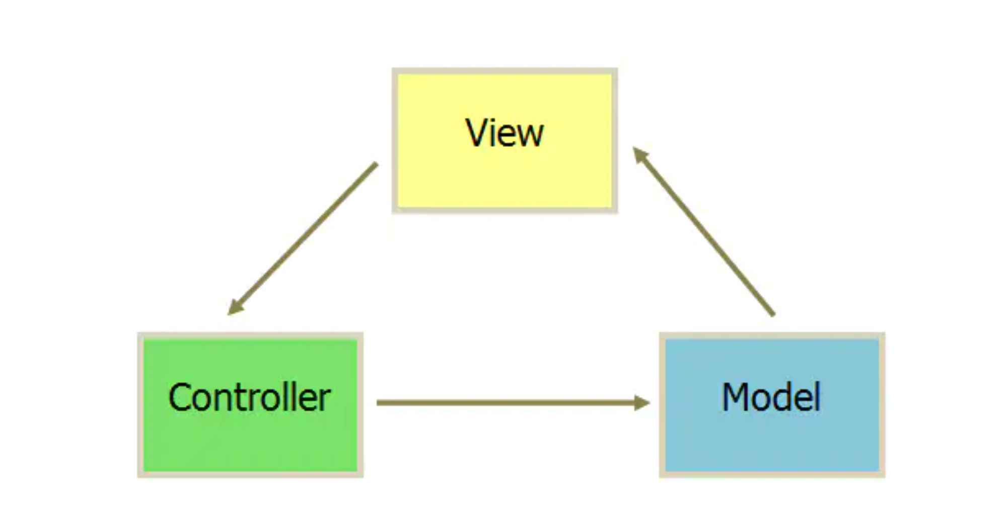

## mvc
一般MVC分为:Model(模型),View(视图),Controller(控制器)。 

View一般用过Controller来和Model进行联系。Controller是Model和View的协调者,View和Model不直接联系。基本都是单向联系。

1.View传送指令到Controller。

2.Controller完成业务逻辑后改变Model状态。

3.Model将新的数据发送至View,用户得到反馈。

## mvp
MVP 模式将 Controller 改名为 Presenter，同时改变了通信方向

1. 各部分之间的通信，都是双向的。

2. View 与 Model 不发生联系，都通过 Presenter 传递。

3. View 非常薄，不部署任何业务逻辑，称为"被动视图"（Passive View），即没有任何主动性，而 Presenter非常厚，所有逻辑都部署在那里。

## MVVM
MVVM是把MVC中的Controller改变成了ViewModel。

双向绑定（data-binding）：View的变动，自动反映在 ViewModel

View的变化会自动更新到ViewModel,ViewModel的变化也会自动同步到View上显示,通过数据来显示视图层。

可重用性: 可以把一些视图逻辑放在一个ViewModel里面,让很多View重用这段视图逻辑。

开发人员可以专注于业务逻辑和数据的开发,设计人员可以专注于页面的设计。

建立了MVVM基础框架
View提供declarative声明性的views
ViewModel提供访问Model的数据，以及Intent functions使得View可以调用Model的函数。View可以共享ViewModel的intent函数，ViewModel的类型为class便于共享, ViewModel建立了Model的实例，因为Model是generic type。

Model提供游戏的数据和逻辑

